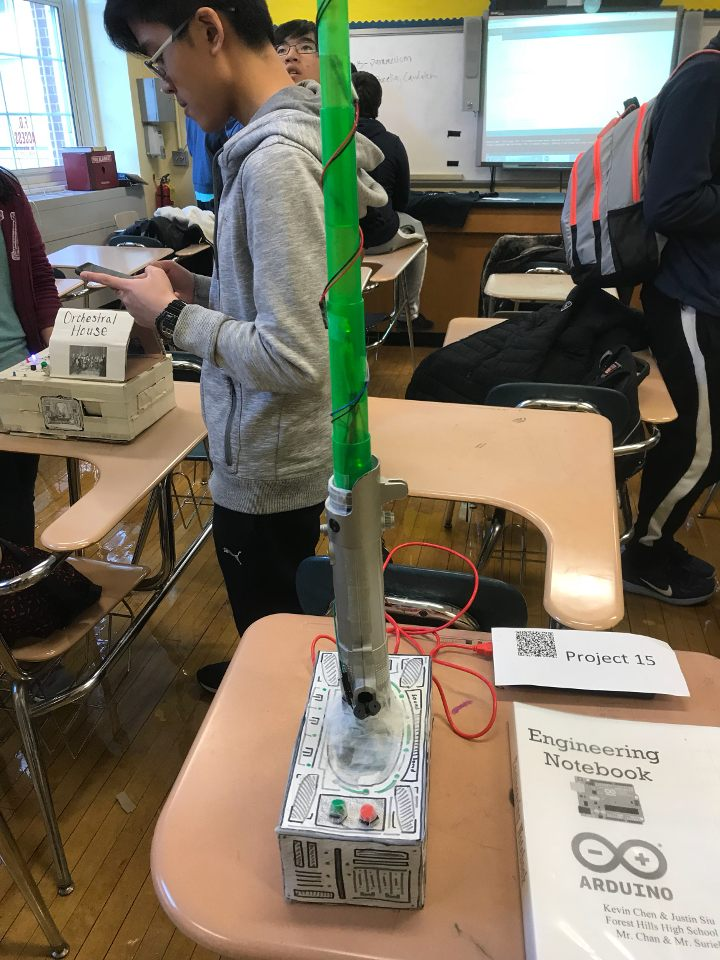

# Arduino-Light-Saber
This project uses LEDs, buzzers, and buttons to create a lightsaber. Using an empty shell, with all the components taken out, this project was able to mimic a lightsaber with custom music and light patterns.

## Walkthrough 

Here's a walkthrough of implemented user stories:

GIF created with [LiceCap](http://www.cockos.com/licecap/).
